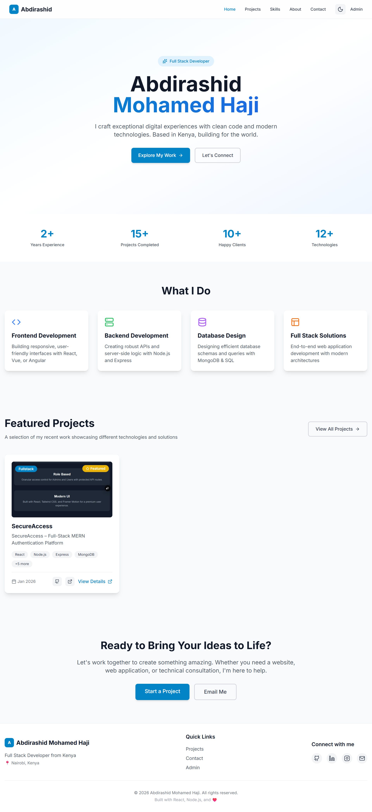
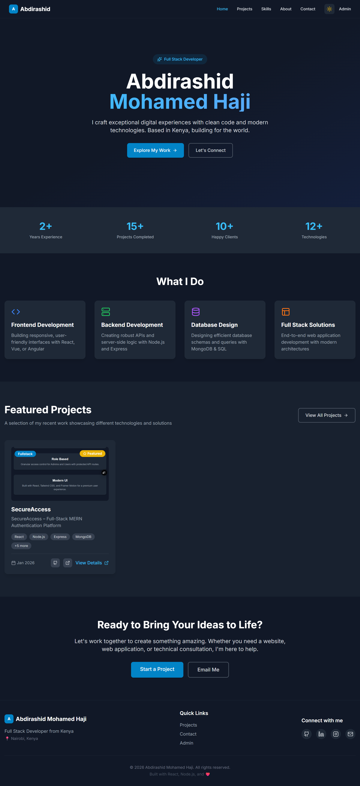

# 🚀 MERN Portfolio – Admin-Driven Full-Stack Application

A **production-ready MERN Stack portfolio application** built to showcase real-world full-stack engineering skills.  
It features a secure admin dashboard, dynamic content management, authentication, email integration, and a modern responsive UI with light/dark mode support.

🌐 **Live Site:** https://abdirashid-portfolio.vercel.app/

---

## ✨ Features

### 🔐 Authentication & Authorization
- JWT-based authentication (Access & Refresh Tokens)
- Role-based access control (Admin vs Public)
- Secure password hashing using bcrypt
- Protected admin-only routes

### 🧑‍💼 Admin Dashboard
- Add, edit, and delete **projects**
- Add, edit, and delete **skills**
- Real-time updates reflected on the public portfolio
- Admin-only access secured with JWT & role checks

### 🌐 Public Portfolio
- Dynamic projects section (CMS-driven)
- Skills categorized by stack
- Fully responsive, mobile-first UI
- Light & Dark mode support
- Clean, professional design

### 📧 Email System
- SMTP-powered contact form
- Messages delivered directly to admin email
- Secure environment-based configuration

### 🛡️ Security Best Practices
- Helmet for HTTP security headers
- MongoDB query sanitization
- XSS protection
- Rate limiting
- Environment variables protection

---

## 🛠️ Tech Stack

### Frontend
- React (Vite)
- Tailwind CSS
- Axios
- React Router
- Framer Motion

### Backend
- Node.js
- Express.js
- MongoDB Atlas
- Mongoose
- JWT Authentication
- Nodemailer (SMTP)

### Tools
- Visual Studio Code
- Git & GitHub
- dotenv
- Nodemon
- Postman

### DevOps & Deployment
- Vercel (Frontend & Backend)
- Environment-based configuration
- Production-ready build setup

---

## 📸 Screenshots

### 🌞 Light Mode

### 🌙 Dark Mode

